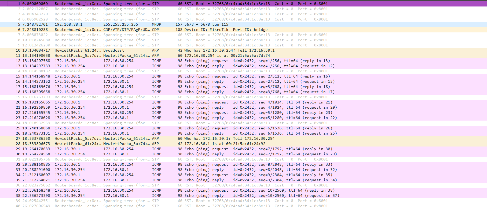

# Experience 2 - Part 1 Configure an IP Network

## Steps
 
1. Connect E0 from Tux33 and Tux34 to one of the switch inlets.
2. Configure each machine's IPs:
 
```bash
 $ ifconfig eth0 up
 $ ifconfig eth0 <IP>
 #172.16.30.1/24 for Tux33
 #172.16.30.254/24 for Tux34
```
 
3. To get each machine's MAC Address, execute `ipconfig` and check `ether`.
4. Check the connection between both machines in the same network and that they send all packets to each other.
 
```bash
 $ ping <IP> -c 10 # Limits the number of packets to 10
 - 172.16.30.254 para o Tux33
 - 172.16.30.1 para o Tux34
```
 
5. The ARP table in Tux33 should have an entry with Tux34.
 
```bash
 $ arp -a # ?(172.16.30.254) at 00:21:5a:5a:7d:74 [ether] on eth0
```
 
6. Delete that entry from the ARP table.
 
```bash
 $ arp -d 172.16.30.254/24
 $ arp -a # empty
```
 
7. Open Wireshark on Tux33 and open eth0 to capture the packets.
8. Execute the following ping command on Tux33:
 
```bash
 $ ping 172.16.30.254/24 -c 10
```
 
9. Stop capturing the packets and save the file to analyze the data.
 


## Questions

What are the commands required to configure this experience? 

```
- ifconfig
- route
- arp
- ping
```

What are the ARP packets and what are they used for?


```
ARP (Address Resolution Protocol) packets's primary purpose is to map an ID address to a physical MAC address.
```


What are the MAC and IP addresses of ARP packets and why?

```
The ARP packets contain two IP addresses, one for the sender (in our case Tux33) and the receiver (Tux34). The sent packet will request the receiver to give it's MAC address. The exchange of these addresses allows devices to update their ARP caches and efficiently communicate at the data link layer.
```

What packets does the ping command generate?

```
While waiting to get the receiving machine's MAC address, the ping command generates ARC packets.
After this, it starts generating ICMP (Internet Control Message Protocol) packets for information exchange.
```

What are the MAC and IP addresses of the ping packets?

```
The IP and MAC address used by the ICMP packets are the addresses from Tux33 and Tux34 machines.
```

How to determine if a receiving Ethernet frame is ARP, IP, ICMP?

```
The used protocol can be determined by the first 2 bytes of the frame (Wireshark indicates them in the 'Protocol' column).
```

How to determine the length of a receiving frame?

```
The length of a receiving frame is displayed on the frame's header (Wireshark displays it in the 'Length' column). 
```

What is the loopback interface and why is it important?

```
The loopback interface is a virtual interface that can be used if one of the IP interfaces in the switch is functional. This makes it possible to verify if the network connections are correctly configured.
```