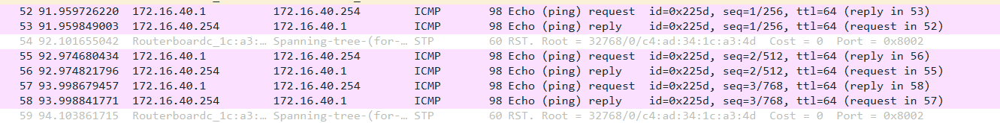
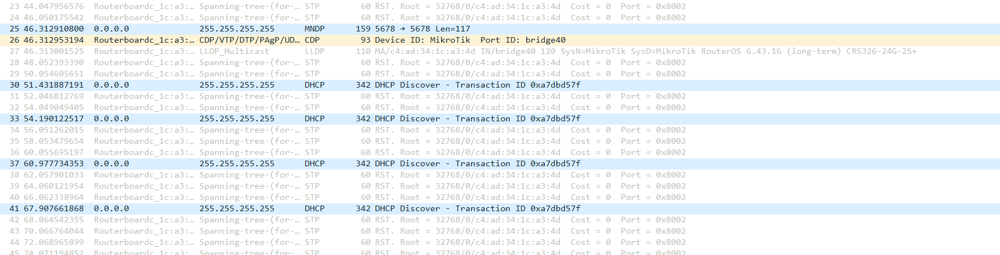

# Experience 2 - Part 2 Implement two bridges in a switch

## Steps

1. Connect E0 from Tux42 to the switch.

2. Connect S0 from Tux42 to communicate with the switch console.

3. Open GKTerm in Tux42 and change the baudrate to 115200.

4. Enter the MicroTik Switch console and reset the switch configurations with the following command:

```bash
admin
system reset-configuration
y
``` 
5. Configure Tux42:

```bash
ifconfig eth0 up
ifconfig eth0 172.16.31.1/24
```

6. Create 2 new bridges in the switch:
```bash
/interface bridge add name=bridge30
/interface bridge add name=bridge31
```

7. Remove the ports to which our 3 machines are connected (The numbers correspond to the port switch the machines are connected to):
```bash
/interface bridge port remove [find interface=ether9]
/interface bridge port remove [find interface=ether10]
/interface bridge port remove [find interface=ether12]
```

8. Add the new ports:
```bash
/interface bridge port add interface=ether9 bridge=bridge31
/interface bridge port add interface=ether10 bridge=bridge30
/interface bridge port add interface=ether12 bridge=bridge30
```

9. Check that the ports were correctly linked with the corresponding brigdes using:
```bash
/interface bridge port print brief
```

10. Start capturing eth0 in Tux43 and ping Tux44 and Tux42:
```bash
ping 172.16.30.254
#Tux44 -> No problems
ping 172.16.31.1
#Tux42 -> connect: Network is unreachable
```

11. Disable broadcast ignoring in every machine:
```bash
sysctl net.ipv4.icmp_echo_ignore_broadcasts=0
```

12. Now start the eth0 capture in every machine. In Tux43, execute the following command:
```bash
ping -b 172.16.30.255
```

13. Stop the captures and start again, but this time you will execute the following command in Tux42:

```bash
ping -b 172.16.31.255
```

## Questions

How to configure bridgeY0?

```
To configure bridgeY0, create a new bridge in the MicroTik switch console and proceed to remove the existing ports that correspond to TuxY3 and TuxY4. After that, create new ports for both machines and add them to bridgeY0.
The commands are as follows:
    /interface bridge create name=bridgeY0
    /interface bridge port remove [find interface=etherXX]
    /interface bridge port remove [find interface=etherYY]
    /interface bridge port add interface=etherXX bridge=bridgeY0
    /interface bridge port add interface=etherYY bridge=bridgeY0
```

How many broadcast domains are there? How can you conclude it from the logs?
```
There are two broadcast domains: one for each bridge (bridgeY0 and bridgeY1).

By analizing our saved logs, we noticed that TuxY3 is able to receive a response from TuxY4, but not from TuxY2. This happens because TuxY4 and TuxY2 are in two different bridges that don't have a connection with eachother.
```


